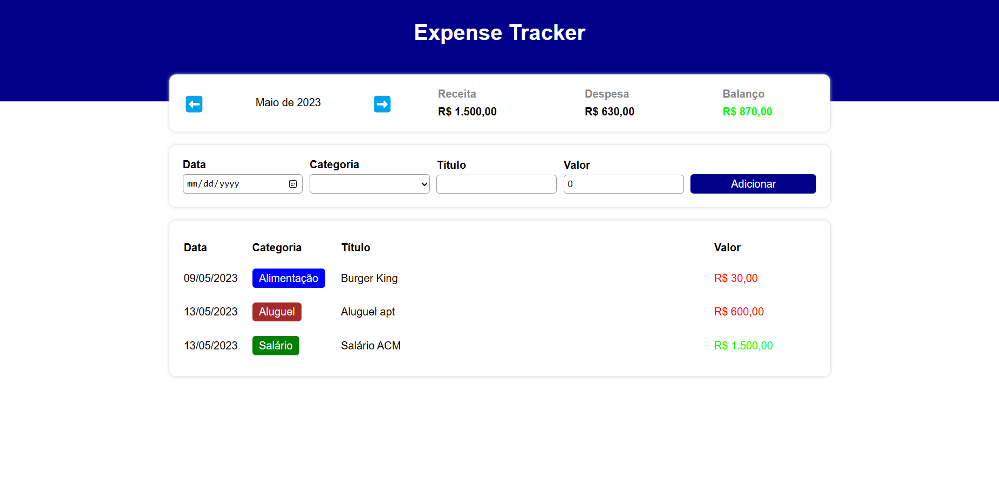

# Expense Tacker

<p>Send messages to your friends and have fun😃!</p>

## Indice
- [preview](#😁-preview)
- [about](#📃-about)
- [tools](#🔨-tools)
- [how to contribute](#♻️-how-to-contribute)

## 😁 Preview


### [See Deploy](https://luan-costa-2l.github.io/expense-tracker/)

## 📃 About

**expense-tacker**  was created so that users can monitor their monthly expenses, classifying them as Income or Expense. If you owe money, at the end of the month the value turns red to alert the user

## 🔨 Tools
- [React](https://legacy.reactjs.org/)
- [Typescript](https://www.typescriptlang.org/)
- [Vite](https://vitejs.dev/)
- [Sass](https://sass-lang.com/)

## ♻️ How to contribute

```bash
    # Clone the project
    $ git clone https://github.com/Luan-Costa-2l/expense-tracker
```

```bash
    # Open the directory
    $ cd expense-tracker
```

```bash
    # Install the dependecies
    $ npm install
```

```bash
    # Run the project
    $ npm run dev
```